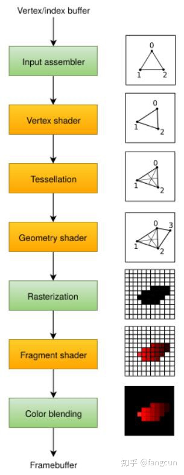

input assembler获取顶点数据，顶点数据的来源可以是应用程序提交的原始顶点数据，或是根据索引缓冲提取的顶点数据。

vertex shader对每个顶点进行模型空间到屏幕空间的变换，然后将顶点数据传递给图形管线的下一阶段。

tessellation shaders根据一定的规则对几何图形进行细分，从而提高网格质量。通常被用来使类似墙面这类不光滑表面看起来更自然。

geometry shader可以以图元(三角形，线段，点)为单位处理几何图形，它可以剔除图元，输出图元。有点类似于tessellation shader，但更灵活。但目前已经不推荐应用程序使用它，geometry shader的性能在除了Intel集成显卡外的大多数显卡上表现不佳。

rasterization阶段将图元离散为片段。片段被用来在帧缓冲上填充像素。位于屏幕外的片段会被丢弃，顶点着色器输出的顶点属性会在片段之间进行插值，开启深度测试后，位于其它片段之后的片段也会被丢弃。

fragment shader对每一个未被丢弃的片段进行处理，确定片段要写入的帧缓冲，它可以使用来自vertex shader的插值数据，比如纹理坐标和顶点法线。

color blending阶段对写入帧缓冲同一像素位置的不同片段进行混合操作。片段可以直接覆盖之前写入的片段，也可以基于之前片段写入的信息进行混合操作。

使用橙色标识的阶段是可编程阶段
